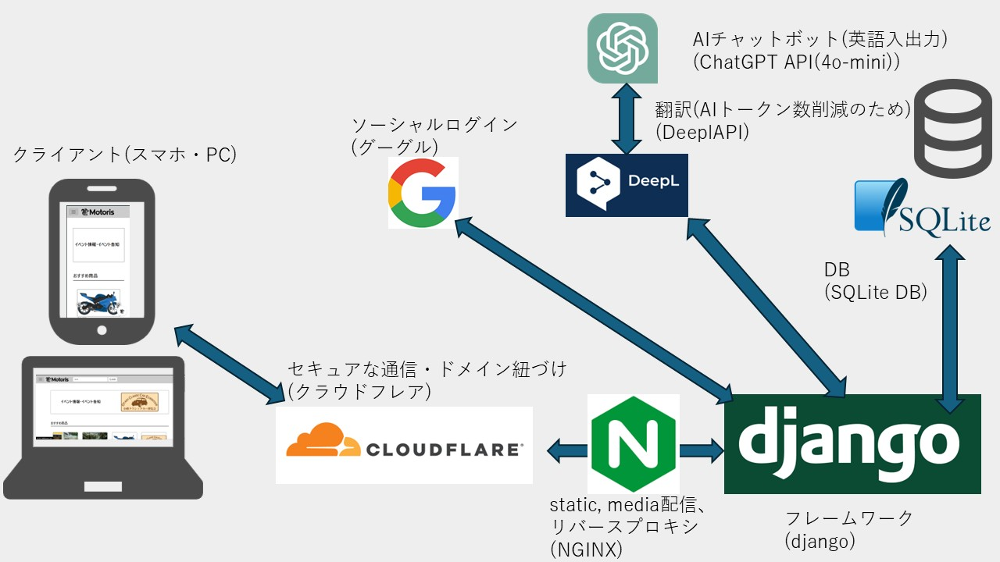

# Motoris — CtoCのモビリティマーケットプレイス

> **HAL名古屋 2年時の進級制作**として1年間開発したプロジェクトです。
> 最終発表では企画力賞を受賞しました。
---

## 概要
**Motoris** は、ユーザー同士が安心・安全に取引できるモビリティ特化型のCtoCマーケットプレイスです。  
売買機能に加え、イベント開催やモビリティ診断、AIチャットボットによるサポートを備え、単なる売買に留まらない価値提供を目指しています。

---

## 紹介動画
👉 [紹介動画を見る](https://www.youtube.com/watch?v=97iO3mqddTA)

## アーキテクチャ

### 技術要素（図の対応）
- **フレームワーク**：Django  
- **Webサーバ/リバースプロキシ**：Nginx（static / media 配信）  
- **DB**：SQLite  
- **認証**：Google ソーシャルログイン  
- **AIチャットボット**：ChatGPT API（o4-mini、英語入出力想定）  
- **翻訳**：DeepL API（AIトークン削減のための前後処理）  
- **セキュア通信/ドメイン**：Cloudflare  
- **クライアント**：スマホ / PC ブラウザ

---

## 主要機能
- アカウント：ソーシャルログイン、マイページ、パスワード再発行
- 出品・購入：商品名の絞り込み出品、内容確認、購入後ガイド
- 診断・提案：モビリティ診断によるレコメンド
- コミュニティ：イベント作成・参加
- サポート：AIチャットボット（FAQ/案内対応）

---

## 開発の目的
- **安心・安全な個人間取引**と**体験価値の継続**（イベント・診断）を両立し、モビリティ好きが集まる場を創出する。

---
